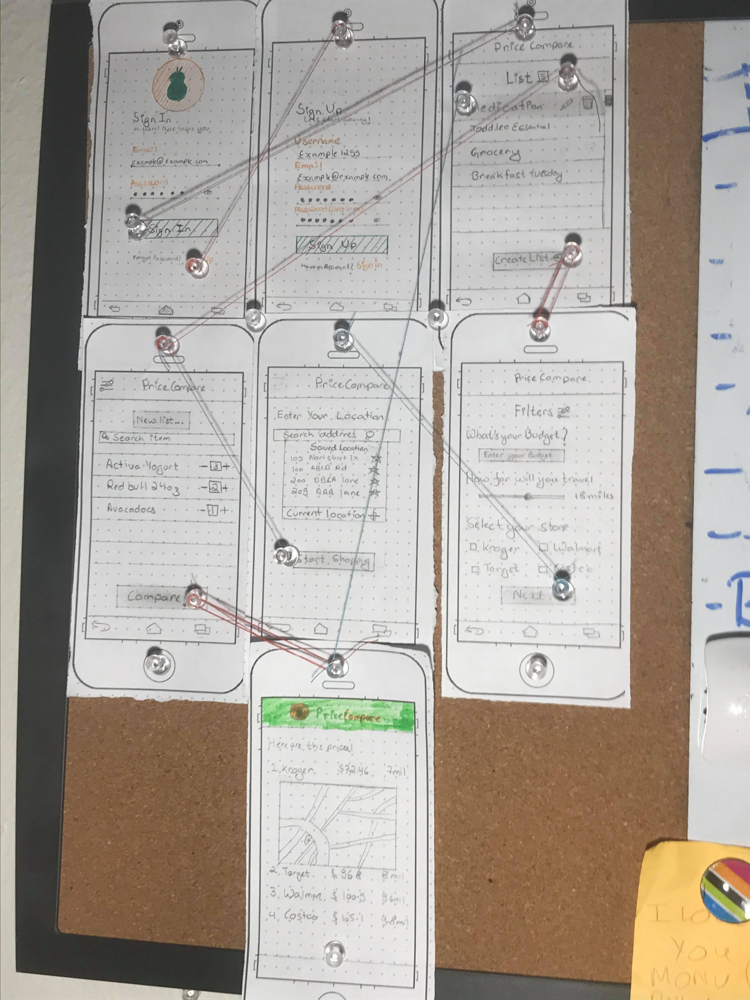

#Project : **PriceCompare**

The app uses a database of common grocery items. Users create shopping lists composing of such items. The system then computes how much their shopping bill would cost at various nearby grocery stores. Results are displayed for the user to determine where the best place for purchase is. For a more accurate estimation, the app's store visit estimation can also include the cost of gas in traveling. The purpose of this app is to help the user save money by making smarter, small decisions in their everyday lives. App would use APIs like the Kroger API or Walmart Open API, GPS, and Google Maps (this is the Distance Matrix API) to find nearby locations. App may also use a coupon API to further the mission of saving the user money.

TEST 1: Test Commit (Biraj Singh GC)

#*SCRUM AGILE BOARD*

#Stories:

  * []User can login
  * []User can sign up 
  * []User can adjust budget expense, distance to travel, and what stores they want to shop at
  * []User can create a shopping list
  * []User can save and edit a list
  * []User can see results and click a link to get directions to that store
  
  
#TO DO:
#On Process:
#Completed:
#Backlog: 

# Price Compare

## Table of Contents
1. [Overview](#Overview)
1. [Product Spec](#Product-Spec)
1. [Wireframes](#Wireframes)
1. Schema

## Overview
### Description

The app uses a database of common grocery items. Users create shopping lists composing of such items. The system then computes how much their shopping bill would cost at various nearby grocery stores. Results are displayed for the user to determine where the best place for purchase is. For a more accurate estimation, the app's store visit estimation can also include the cost of gas in traveling. The purpose of this app is to help the user save money by making smarter, small decisions in their everyday lives. App would use APIs like the Kroger API or Walmart Open API, GPS, and Google Maps (this is the Distance Matrix API) to find nearby locations. App may also use a coupon API to further the mission of saving the user money.

### App Evaluation
[Evaluation of your app across the following attributes]
- **Category:** Shopping/ Coupon
- **Mobile:** This app would be primarily developed for mobile but would perhaps be just as viable on a computer, such as tinder or other similar apps. Functionality wouldn’t be limited to mobile devices
- **Story:** Analyzes Users shopping list to evaluate/dertermine the perfect store to shop at making their budget, location, radius and store as factors.
- **Market:** Any individual willing to save money on shopping could use this app.
- **Habit:** This app can be used often as it is planned to save money for users which people usually tend to do.
- **Scope:** There is a large potential for the app if we manage to attract users with easy to navigate app.

## Product Spec

### 1. User Stories (Required and Optional)

**Required Must-have Stories**

  * []User can login
  * []User can sign up 
  * []User can adjust budget expense, distance to travel, and what stores they want to shop at
  * []User can create a shopping list
  * []User can save and edit a list
  * []User can see results and click a link to get directions to that store
  
**Optional Nice-to-have Stories**

* Exception handling (e.g., invalid address, too low budget) 
* “Favorite Products” Page as in Angelica’s Wireframes 
* User can login with Facebook 
* User can login with Google 
* Brand Preference of Grocery Products  
* Improve UI/UX 
* Price of Gas is also accounted for in the “Results” Page 
* An in-app Forum for users to create their own postings and view the posting of other users in their area (as filtered by their distance) on nearby store deals (e.g., Walmart’s 10 corn for $10) 
* Use a Coupon API to suggest coupons the user can use to save even more money 

### 2. Screen Archetypes

* Login 
* Sign Up / Register
* List Screen
    *This tab has previosly saved list that user can access. 
    *User also has an option to create a new list, edit list or delete old list in this tab.
* Create list
    * Filter Screen: Allows user to select their filter
    * Location: Allows user to enter location
    * New List: Allows user to add new item
* Result Screen

### 3. Navigation

**Tab Navigation** (Tab to Screen)

* List

**Flow Navigation** (Screen to Screen)

* Login -> List
* List -> Create list(Filter Screen) | List -> Result Screen | List -> New List(Edit list)
* Filter Screen -> Location -> New List
* New List -> Result

## Wireframes
[Add picture of your hand sketched wireframes in this section]

# Schema

## Models 

##### User: 

Property | Type | Description
----------|----| ----------
username | String | name of the current user
address | String | address saved by user

##### Product: 

Property | Type | Description 
---------| ------| ----------
name | String | item name 
price | Number | price of the item 
store_name | String | the store name of where the item is located

##### Store: 

Property | Type | Description 
---------| ------| --------
street | String | street of store
city | String | city of store
state | String | state of store
zip | String | zipcode of store location 

### Networking
#### List of network requests by screen
   - List Screen
      - (Create/POST) Create a new list
      - (Delete) Delete existing list
      - (Create/POST) Edit Existing list
   - Create List screen 
      - (Create/POST) Add objects to list
   - result screen
      - (Read/GET) Query data from IM API
      

##### An API Of Information Machine
- Base URL - [https://api.iamdata.co/](https://api.iamdata.co/)
 HTTP Verb | Endpoint | Description
   ----------|----------|------------
    `GET`    | /v1/product_prices | get product prices
    `GET`    | /v1/products/{product_id} | get product name
    `GET`    | /v1/products/{product_id} | get product id
    `GET`    | /v1/user_stores | get store information.
    
    

